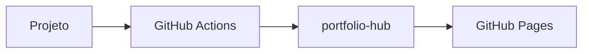

# Portfolio Hub

O `portfolio-hub` é um agregador estático de projetos, documentação e changelogs publicado com Astro no GitHub Pages.

A proposta é simples: cada projeto continua dono do seu próprio código e da sua própria documentação, enquanto o hub centraliza a apresentação, o histórico de releases e a navegação em um único lugar.

## O que o projeto resolve

Portfolios técnicos costumam sofrer com três problemas:

1. a lista de projetos fica desatualizada;
2. a documentação fica espalhada entre vários repositórios;
3. o histórico de releases não aparece de forma consistente.

O `portfolio-hub` resolve isso com um modelo baseado em arquivos versionados no Git:

- cada projeto é descrito por um arquivo em `projects/`;
- a documentação renderizada pelo hub fica em `docs/<slug-do-projeto>/`;
- o changelog de cada projeto fica em `changelogs/<slug-do-projeto>.md`;
- o site é gerado estaticamente e publicado no GitHub Pages;
- integrações entre repositórios podem atualizar docs e releases via GitHub Actions.

## Como o hub é organizado

A estrutura principal do repositório segue este padrão:

```text
portfolio-hub/
├── projects/
│   └── meu-projeto.json
├── docs/
│   └── meu-projeto/
│       ├── README.md
│       ├── architecture.md
│       ├── usage.md
│       └── api.md
├── changelogs/
│   └── meu-projeto.md
├── src/
└── public/
```

Cada parte tem uma responsabilidade clara:

| Caminho | Responsabilidade |
|---|---|
| `projects/*.json` | Metadados de listagem e status do projeto |
| `docs/<slug>/` | Documentação renderizada na página do projeto |
| `changelogs/<slug>.md` | Histórico de releases e mudanças |
| `src/pages/index.astro` | Homepage com listagem e filtros |
| `src/pages/projects/[slug].astro` | Página individual do projeto |

## Como um projeto aparece no site

Para um projeto ser exibido corretamente no hub, ele precisa de três blocos de informação:

### 1. Metadados do projeto

Arquivo em `projects/<slug>.json`.

Exemplo:

```json
{
  "name": "meu-projeto",
  "display_name": "Meu Projeto",
  "description": "Descrição curta do projeto.",
  "version": "1.2.0",
  "status": "active",
  "tags": ["astro", "docs", "gitops"],
  "repo_url": "https://github.com/seu-usuario/meu-projeto",
  "docs_updated_at": "2026-04-21T00:00:00Z",
  "changelog_updated_at": "2026-04-21T00:00:00Z"
}
```

### 2. Documentação do projeto

Pasta em `docs/<slug>/` contendo arquivos Markdown.

Arquivos recomendados:

- `README.md` — visão geral;
- `architecture.md` — arquitetura, fluxos e diagramas;
- `usage.md` — setup, operação e integração;
- `api.md` — referência técnica, quando fizer sentido;
- `security.md`, `deploy.md`, `monitoring.md` — opcionais.

### 3. Changelog do projeto

Arquivo em `changelogs/<slug>.md` registrando releases e mudanças importantes.

## Fluxo de atualização

O hub funciona bem tanto manualmente quanto com automação.

### Fluxo manual

Você pode atualizar este repositório diretamente:

1. editar `projects/<slug>.json`;
2. editar `docs/<slug>/*.md`;
3. editar `changelogs/<slug>.md`;
4. fazer commit e push.

Esse modo já é suficiente para manter o portfolio atualizado.

### Fluxo automatizado

Se os projetos vivem em repositórios separados, eles podem notificar o hub com workflows do GitHub Actions usando `repository_dispatch`.

Os dois eventos mais comuns são:

- `update-docs` — sincroniza documentação;
- `new-release` — atualiza versão e changelog.

Esse modelo mantém o hub como camada central de apresentação sem exigir que o código de todos os projetos fique no mesmo repositório.

## Status do projeto

O campo `status` em `projects/<slug>.json` é usado para comunicar o momento de vida do projeto na homepage e nos cards.

Valores suportados:

| Status | Significado |
|---|---|
| `active` | Projeto em uso, mantido ou pronto para demonstração |
| `wip` | Projeto em desenvolvimento, ainda em evolução |
| `archived` | Projeto encerrado, legado ou mantido apenas como referência |

Recomendação prática:

- use `active` para projetos que você quer destacar;
- use `wip` para iniciativas em construção;
- use `archived` para histórico técnico e portfólio de aprendizado.

## Ordenação da documentação

A sidebar da documentação é montada a partir dos arquivos dentro de `docs/<slug>/`.

A ordenação segue duas regras:

### Ordem explícita por prefixo numérico

Se você quiser controlar a ordem com precisão, use prefixos no nome do arquivo:

```text
docs/meu-projeto/
├── 01-readme.md
├── 02-architecture.md
├── 03-usage.md
└── 04-api.md
```

### Ordem por nomes convencionais

Sem prefixo numérico, nomes conhecidos como `README`, `architecture`, `usage` e `api` tendem a formar uma navegação previsível e fácil de manter.

Boa prática:

- use prefixo numérico quando a ordem for importante;
- use nomes semânticos quando a documentação for simples.

## Ícones por frontmatter

Cada documento pode definir seu ícone diretamente no Markdown usando frontmatter YAML.

Exemplo:

```md
---
title: Arquitetura
icon: layers
---

# Arquitetura
```

O hub já suporta vários ícones e também faz fallback automático por nome de arquivo.

Algumas opções disponíveis:

- `home`
- `layers`
- `terminal`
- `code`
- `zap`
- `file`
- `book`
- `changelog`
- `clock`
- `shield`
- `database`
- `settings`
- `list`
- `star`
- `link`
- `chart`
- `package`
- `github`

Se `icon` não for informado, o sistema tenta inferir pelo nome do arquivo. Se não encontrar correspondência, usa `file`.

## Changelog

Cada projeto pode ter um changelog próprio em `changelogs/<slug>.md`.

O formato recomendado é inspirado em **Keep a Changelog**, com seções por versão e data.

Exemplo:

```md
# Changelog

## [1.2.0] - 2026-04-21

### Added
- Novo fluxo de sincronização de documentação
- Badge de status na homepage

### Changed
- Ajuste visual no card do projeto

### Fixed
- Correção na ordenação da sidebar
```

Boas práticas para changelog:

- registrar apenas mudanças relevantes para quem consome o projeto;
- usar categorias consistentes como `Added`, `Changed`, `Fixed`, `Removed`;
- manter uma entrada por release;
- evitar changelog gerado de forma caótica a partir de commits brutos.

## Suporte a Mermaid

A documentação renderizada pelo hub suporta blocos `mermaid`, permitindo diagramas de fluxo, sequência, arquitetura e outros tipos.

Exemplo:



Isso é útil para explicar pipelines, integrações, dependências e arquitetura de forma visual.

## Quando criar um novo projeto no hub

Crie um novo projeto quando você precisar de:

- uma entrada dedicada na homepage;
- documentação isolada por slug;
- changelog independente;
- filtros por tags;
- status próprio (`active`, `wip`, `archived`).

Na prática, cada projeto listado no hub deve representar uma unidade clara do seu portfolio: aplicação, biblioteca, automação, API, template ou estudo relevante.

## Resumo operacional

Para adicionar ou manter um projeto no `portfolio-hub`, pense sempre neste checklist:

1. criar ou atualizar `projects/<slug>.json`;
2. manter `docs/<slug>/` com arquivos bem organizados;
3. manter `changelogs/<slug>.md` com histórico legível;
4. usar `status` corretamente;
5. usar `icon` nos documentos quando quiser personalizar a sidebar;
6. publicar via push no repositório do hub ou via workflows integrados.

## Próximos passos

Depois desta visão geral, o fluxo recomendado é:

1. ler **Arquitetura** para entender os eventos e a organização do hub;
2. ler **Como Usar** para configurar projetos, workflows e convenções de conteúdo.
