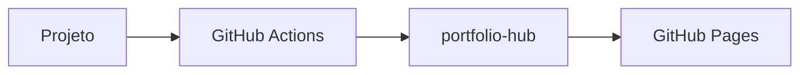

# Portfolio Hub

O `portfolio-hub` é um portfólio técnico estático publicado com Astro no GitHub Pages. Ele agrega projetos, documentação viva e changelogs de múltiplos repositórios em um único lugar, atualizado automaticamente via GitHub Actions.

A proposta central é simples: cada projeto continua dono do seu próprio código e da sua própria documentação, enquanto o hub centraliza a apresentação, o histórico de releases e a navegação.

## O que o projeto resolve

Portfólios técnicos costumam sofrer com três problemas:

1. a lista de projetos fica desatualizada rapidamente;
2. a documentação fica espalhada entre vários repositórios sem ponto central;
3. o histórico de releases não aparece de forma consistente.

O `portfolio-hub` resolve isso com um modelo baseado em arquivos versionados no Git:

- cada projeto é descrito por um arquivo JSON em `projects/`;
- a documentação renderizada pelo hub fica em `docs/<slug>/`;
- o changelog de cada projeto fica em `changelogs/<slug>.md`;
- o site é gerado estaticamente e publicado no GitHub Pages;
- repositórios externos atualizam docs e releases via `repository_dispatch`.

## Estrutura do repositório

```text
portfolio-hub/
├── projects/
│   └── meu-projeto.json          # metadados: versão, status, tags, repo_url
├── docs/
│   └── meu-projeto/
│       ├── README.md             # visão geral
│       ├── architecture.md       # arquitetura e decisões
│       └── usage.md              # operação e integração
├── changelogs/
│   └── meu-projeto.md            # histórico de releases
├── content/
│   └── blog/                     # posts do blog (Markdown)
└── src/
    ├── components/               # Nav, ProjectCard, BlogCard
    ├── layouts/                  # Layout global
    └── pages/                    # index, blog, projects/[slug]
```

Cada parte tem uma responsabilidade clara:

| Caminho | Responsabilidade |
|---|---|
| `projects/*.json` | Metadados de listagem, versão e status |
| `docs/<slug>/` | Documentação técnica renderizada na página do projeto |
| `changelogs/<slug>.md` | Histórico de releases por projeto |
| `content/blog/` | Posts do blog em Markdown |
| `src/config.ts` | Configuração central do site (usuário, LinkedIn, nome) |

## Como um projeto aparece no site

Para um projeto ser exibido corretamente no hub, ele precisa de três blocos de informação:

### 1. Metadados (`projects/<slug>.json`)

```json
{
  "name": "meu-projeto",
  "display_name": "Meu Projeto",
  "description": "Descrição curta do projeto.",
  "version": "1.2.0",
  "status": "active",
  "tags": ["astro", "docs", "gitops"],
  "repo_url": "https://github.com/MatheusAzevedoDev/meu-projeto",
  "docs_updated_at": "2026-04-21T00:00:00Z",
  "changelog_updated_at": "2026-04-21T00:00:00Z"
}
```

### 2. Documentação (`docs/<slug>/`)

Arquivos Markdown na pasta do projeto. Arquivos recomendados:

- `README.md` — visão geral e quickstart
- `architecture.md` — fluxos, diagramas e decisões
- `usage.md` — setup, operação e integração
- `api.md` — referência técnica (quando aplicável)

Cada documento pode definir `title` e `icon` via frontmatter:

```md
---
title: Arquitetura
icon: layers
---
```

### 3. Changelog (`changelogs/<slug>.md`)

Histórico de releases no formato Keep a Changelog. Gerado automaticamente pelos projetos que usam o `project-template`.

## Fluxos de atualização

### Fluxo manual

Você edita diretamente os arquivos no repositório do hub e faz push. Adequado para manutenção pontual.

### Fluxo automatizado via project-template

Projetos criados a partir do [project-template](https://github.com/MatheusAzevedoDev/project-template) enviam um `repository_dispatch: project-update` ao hub a cada merge em `main`. O hub atualiza metadados, docs e changelog automaticamente e dispara um novo deploy.

```
feature/foo → develop → main
                            └─▶ repository_dispatch: project-update
                                       └─▶ portfolio-hub atualizado
                                                  └─▶ GitHub Pages redeploy
```

### Fluxo granular (update-docs / new-release)

Para repositórios que preferem separar a atualização de documentação da publicação de releases, o hub também aceita dois eventos distintos:

- `update-docs` — sincroniza apenas `docs/<slug>/` e `docs_updated_at`
- `new-release` — atualiza `version`, `changelog_updated_at` e `changelogs/<slug>.md`

## Status do projeto

O campo `status` comunica o momento de vida do projeto na homepage:

| Status | Significado |
|---|---|
| `active` | Em uso, mantido ou pronto para demonstração |
| `wip` | Em desenvolvimento ativo |
| `archived` | Encerrado, legado ou mantido só como referência |

## Ícones por frontmatter

Cada documento pode definir seu ícone no frontmatter:

```md
---
title: Como Usar
icon: terminal
---
```

Ícones disponíveis: `home` · `layers` · `terminal` · `code` · `zap` · `file` · `book` · `changelog` · `clock` · `shield` · `database` · `settings` · `list` · `star` · `link` · `chart` · `package` · `github`

Se `icon` não for informado, o sistema infere pelo nome do arquivo.

## Suporte a Mermaid

A documentação aceita blocos `mermaid` para diagramas de fluxo, sequência e arquitetura:

````markdown

````

## Resumo operacional

Para adicionar ou manter um projeto no hub:

1. criar ou garantir que `projects/<slug>.json` existe;
2. manter `docs/<slug>/` com arquivos organizados;
3. manter `changelogs/<slug>.md` com histórico legível;
4. usar `status` e `tags` de forma consistente;
5. usar `icon` nos documentos para personalizar a sidebar.

## Próximos passos

- **Arquitetura** — entenda os eventos, workflows e a organização interna do hub
- **Como Usar** — configure projetos, documente e integre repositórios externos
- **SETUP.md** — guia passo a passo para configurar tudo do zero
