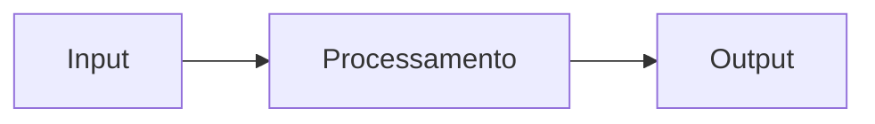

# Setup Guide — Portfolio Hub

Referência completa para configurar o site, publicar posts, integrar projetos e entender os fluxos de automação.

---

## Índice

1. [Configuração inicial do site](#1-configuração-inicial-do-site)
2. [Adicionando posts no blog](#2-adicionando-posts-no-blog)
3. [Integrando um novo projeto](#3-integrando-um-novo-projeto)
4. [Fluxo de desenvolvimento nos projetos](#4-fluxo-de-desenvolvimento-nos-projetos)
5. [Conventional Commits](#5-conventional-commits)
6. [Como o changelog e as releases funcionam](#6-como-o-changelog-e-as-releases-funcionam)
7. [Referência dos workflows do hub](#7-referência-dos-workflows-do-hub)

---

## 1. Configuração inicial do site

Edite `src/config.ts`:

```ts
export const SITE_CONFIG = {
  githubUser: 'seu-usuario',
  linkedinUrl: 'https://linkedin.com/in/seu-perfil',
  repoName: 'portfolio-hub',
  siteName: 'Seu Nome',
  siteDescription: 'Descrição do site para SEO',
};
```

Esse arquivo alimenta a navbar (botões GitHub e LinkedIn), o título das páginas e os metadados de SEO.

---

## 2. Adicionando posts no blog

Posts ficam em `content/blog/` como arquivos Markdown com frontmatter YAML.

### Criando um post

Crie `content/blog/meu-post.md`. O nome do arquivo vira a URL: `/blog/meu-post`.

```markdown
---
title: Título do Post
description: Um parágrafo descrevendo o assunto — aparece na listagem e no SEO.
date: 2026-04-21
tags: [Go, GitOps, Backend]
featured: true
---

Conteúdo do post em Markdown aqui.
```

### Campos do frontmatter

| Campo | Obrigatório | Descrição |
|-------|-------------|-----------|
| `title` | sim | Título exibido na listagem e no post |
| `description` | não | Subtítulo/resumo — aparece na listagem |
| `date` | sim | Data no formato `YYYY-MM-DD` — define a ordenação |
| `tags` | não | Array de tags — ativa o filtro na listagem |
| `featured` | não | `true` exibe o post como destaque no topo |

> Apenas um post deve ter `featured: true`. Se nenhum tiver, o post mais recente é destacado automaticamente.

### Formatação suportada

O conteúdo aceita Markdown padrão e blocos de código com sintaxe destacada:

````markdown
## Título de seção

Parágrafo com **negrito**, _itálico_ e `código inline`.

```go
func main() {
    fmt.Println("hello")
}
```

> Blockquote para citações ou notas.
````

Para diagramas, use blocos `mermaid`:

````markdown

````

### Publicando

```bash
git add content/blog/meu-post.md
git commit -m "docs: add post sobre meu tema"
git push
```

O GitHub Actions faz o deploy automaticamente após o push em `main`.

---

## 3. Integrando um novo projeto

### Passo 1 — Criar o repositório a partir do template

Acesse [MatheusAzevedoDev/project-template](https://github.com/MatheusAzevedoDev/project-template) e clique em **Use this template → Create a new repository**.

O novo repositório já vem com:
- CI que abre PR automático para `develop` em branches `feature/` e `bug/`
- Workflow que abre PR automático de `develop` para `main`
- Release automática com bump de versão, changelog e notificação ao portfolio-hub
- Commitlint + Husky para validação local de commits
- Estrutura de documentação em `docs/`

### Passo 2 — Configurar o `PORTFOLIO_TOKEN`

O token já está configurado como secret da organização **MatheusAzevedoDev** e é herdado automaticamente por todos os repositórios criados dentro dela. Nenhuma ação extra é necessária.

> Se o repositório for criado fora da organização, adicione o secret manualmente em **Settings → Secrets and variables → Actions → New repository secret** com o nome `PORTFOLIO_TOKEN`.

### Passo 3 — Clonar e instalar

```bash
git clone https://github.com/MatheusAzevedoDev/seu-projeto
cd seu-projeto
npm install
```

O `npm install` ativa o Husky automaticamente via script `prepare`.

### Passo 4 — (Opcional) Pré-registrar no portfolio-hub

O arquivo `projects/seu-projeto.json` é **criado automaticamente** pelo workflow `project-update.yml` na primeira release. Você pode criá-lo manualmente se quiser definir o `status` ou aparecer no hub antes da primeira release:

```json
{
  "name": "seu-projeto",
  "display_name": "Seu Projeto",
  "description": "Descrição breve e impactante",
  "version": "0.1.0",
  "tags": ["Go", "Node", "Docker"],
  "repo_url": "https://github.com/MatheusAzevedoDev/seu-projeto",
  "status": "wip",
  "docs_updated_at": "",
  "changelog_updated_at": ""
}
```

**Status válidos:** `active` | `wip` | `archived`

```bash
git checkout -b feat/add-seu-projeto
git add projects/seu-projeto.json
git commit -m "feat: add seu-projeto"
git push origin feat/add-seu-projeto
# abra o PR para main
```

---

## 4. Fluxo de desenvolvimento nos projetos

Todo projeto criado a partir do template segue este fluxo:

```
feature/foo  ou  bug/foo
       │
       │  push → CI verifica o código
       │          PR automático aberto para develop
       ▼
    develop
       │
       │  merge → PR automático aberto para main
       ▼
     main  (produção)
       │
       │  merge → bump de versão detectado pelos commits
       │          CHANGELOG.md gerado
       │          tag vX.Y.Z criada
       │          release publicada no GitHub
       │          portfolio-hub notificado via repository_dispatch
       ▼
  portfolio-hub atualizado e redeploy automático
```

Sempre trabalhe em branches com prefixo `feature/` ou `bug/`. A branch `develop` é criada automaticamente pelo CI na primeira vez que uma dessas branches recebe um push.

---

## 5. Conventional Commits

Todos os projetos usam o padrão [Conventional Commits](https://www.conventionalcommits.org/).

```bash
git commit -m "feat: adiciona endpoint de autenticação"
git commit -m "fix: corrige timeout na conexão com o banco"
git commit -m "feat(auth): adiciona refresh token"
git commit -m "fix(api): retorno 404 incorreto na rota /users"
```

### Tipos reconhecidos

| Tipo | Aparece no changelog | Quando usar |
|------|---------------------|-------------|
| `feat` | sim — Features | Nova funcionalidade |
| `fix` | sim — Bug Fixes | Correção de bug |
| `perf` | sim — Performance | Melhoria de performance |
| `docs` | não | Somente documentação |
| `refactor` | não | Refatoração sem mudança funcional |
| `test` | não | Testes |
| `chore` | não | Build, dependências, CI |

O escopo entre parênteses é opcional. Use o Commitizen para um assistente interativo:

```bash
npm run commit
```

---

## 6. Como o changelog e as releases funcionam

A cada merge em `main`, o CI detecta o tipo de bump analisando os commits desde a última tag:

| Commits contêm | Bump | Exemplo |
|----------------|------|---------|
| `tipo!:` ou `BREAKING CHANGE` | major | `1.2.0 → 2.0.0` |
| `feat:` | minor | `1.2.0 → 1.3.0` |
| qualquer outro | patch | `1.2.0 → 1.2.1` |

Após o bump, o CI automaticamente:

1. Atualiza a versão no `package.json`
2. Regenera o `CHANGELOG.md` completo
3. Commita, cria a tag `vX.Y.Z` e faz push
4. Publica a release no GitHub com o changelog
5. Envia um `repository_dispatch: project-update` ao portfolio-hub

O portfolio-hub recebe o evento e atualiza `projects/seu-projeto.json`, `docs/seu-projeto/` e `changelogs/seu-projeto.md` automaticamente, disparando um novo deploy.

> Mudanças apenas em `docs/` ou `CHANGELOG.md` não disparam o CI de release — sem risco de loop ou sobrescrita.

### Gerando o changelog localmente

```bash
# Desde o último tag
npm run changelog

# Regenera o arquivo inteiro do zero
npm run changelog:all
```

### Editando manualmente

Para ajustar descrições ou remover ruído, edite e commite somente o `CHANGELOG.md`:

```bash
code CHANGELOG.md
git add CHANGELOG.md
git commit -m "docs: ajusta changelog"
git push
```

### Criando a primeira release (v1.0.0)

Por padrão o projeto começa na versão `0.1.0`. Para marcar como `1.0.0`, crie a tag manualmente antes do primeiro merge em `main`:

```bash
git tag v1.0.0
git push --tags
```

A partir daí o CI usa essa tag como base para os bumps automáticos.

---

## 7. Referência dos workflows do hub

O portfolio-hub aceita três eventos via `repository_dispatch`. O project-template usa o `project-update` (tudo em um). Os outros dois permitem granularidade para repos que preferem separar docs de releases.

### `project-update` — tudo em um

Usado pelo project-template. Atualiza metadados, busca docs e changelog em uma única chamada.

**Payload:**

```json
{
  "event_type": "project-update",
  "client_payload": {
    "project": "nome-do-projeto",
    "display_name": "Nome Exibido",
    "version": "1.2.0",
    "description": "Descrição do projeto",
    "tags": ["Go", "Docker"],
    "repo": "MatheusAzevedoDev/nome-do-projeto"
  }
}
```

### `update-docs` — somente documentação

Ideal para repositórios que atualizam docs com frequência independentemente de releases.

**Payload:**

```json
{
  "event_type": "update-docs",
  "client_payload": {
    "project": "nome-do-projeto",
    "repo_url": "https://github.com/MatheusAzevedoDev/nome-do-projeto",
    "commit_sha": "abc123",
    "updated_at": "2026-04-21T10:00:00Z"
  }
}
```

O hub busca todos os arquivos de `docs/` no commit especificado e atualiza `docs/nome-do-projeto/` e o campo `docs_updated_at`.

### `new-release` — somente release

Ideal para repositórios com processo de release próprio.

**Payload:**

```json
{
  "event_type": "new-release",
  "client_payload": {
    "project": "nome-do-projeto",
    "display_name": "Nome Exibido",
    "version": "1.2.0",
    "description": "Descrição do projeto",
    "repo_url": "https://github.com/MatheusAzevedoDev/nome-do-projeto",
    "updated_at": "2026-04-21T10:00:00Z"
  }
}
```

O hub atualiza `projects/nome-do-projeto.json` e busca o `CHANGELOG.md` do repositório (ou usa o body da release como fallback).

---

## Checklist — novo projeto

- [ ] Repo criado a partir do [project-template](https://github.com/MatheusAzevedoDev/project-template)
- [ ] `npm install` rodado localmente
- [ ] Secret `PORTFOLIO_TOKEN` verificado (herdado da org ou configurado manualmente)
- [ ] `docs/README.md` preenchido com visão geral do projeto
- [ ] `docs/architecture.md` preenchido com decisões de design
- [ ] Primeiro commit em uma branch `feature/` mergeado até `main`
- [ ] Verificar se `projects/seu-projeto.json` foi criado automaticamente no hub

---

**Referências:** [Conventional Commits](https://www.conventionalcommits.org/) · [Semantic Versioning](https://semver.org/) · [Keep a Changelog](https://keepachangelog.com/)
