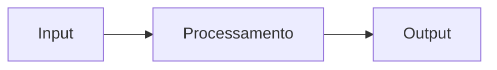

# Setup Guide — Portfolio Hub

Referência para configurar o site, adicionar posts no blog, e integrar novos projetos.

---

## Índice

1. [Adicionando Posts no Blog](#adicionando-posts-no-blog)
2. [Integrando um Novo Projeto](#integrando-um-novo-projeto)
3. [Fluxo de desenvolvimento nos projetos](#fluxo-de-desenvolvimento-nos-projetos)
4. [Conventional Commits](#conventional-commits)
5. [Como o changelog e as releases funcionam](#como-o-changelog-e-as-releases-funcionam)
6. [Templates de Configuração](#templates-de-configuração)

---

## Adicionando Posts no Blog

Posts ficam em `content/blog/` como arquivos Markdown com frontmatter YAML.

### Criando um post

Crie um arquivo em `content/blog/meu-post.md`. O nome do arquivo vira a URL: `/blog/meu-post`.

```markdown
---
title: Título do Post
description: Um parágrafo descrevendo o assunto — aparece na listagem e no SEO.
date: 2026-04-21
tags: [Go, GitOps, Backend]
featured: true
---

Conteúdo do post em Markdown aqui.
```

### Campos do frontmatter

| Campo | Obrigatório | Descrição |
|-------|-------------|-----------|
| `title` | sim | Título exibido na listagem e no post |
| `description` | não | Subtítulo/resumo — aparece na listagem |
| `date` | sim | Data no formato `YYYY-MM-DD` — define a ordenação |
| `tags` | não | Array de tags, ex: `[Go, GitOps]` — ativa o filtro |
| `featured` | não | `true` exibe o post como destaque no topo da listagem |

> Apenas um post deve ter `featured: true`. Se nenhum tiver, o post mais recente é destacado automaticamente.

### Formatação suportada

O conteúdo aceita Markdown padrão:

````markdown
## Título de seção

Parágrafo com **negrito**, _itálico_ e `código inline`.

- Item de lista
- Outro item

```go
func main() {
    fmt.Println("hello")
}
```

> Blockquote para citações ou notas.
````

Para diagramas, use blocos de código com a linguagem `mermaid`:

````markdown

````

### Fluxo de publicação

1. Crie o arquivo em `content/blog/`
2. Faça commit e push para `main`
3. O GitHub Actions faz o deploy automaticamente

```bash
git add content/blog/meu-post.md
git commit -m "docs: add post sobre meu tema"
git push
```

---

## Integrando um Novo Projeto

### 1. Criar o repo a partir do template

Acesse o repositório [project-template](https://github.com/uMatheusx/project-template) e clique em **Use this template → Create a new repository**.

O novo repo já vem com CI, changelog automático, commitlint, Husky e estrutura de docs prontos.

### 2. Configurar o secret `PORTFOLIO_TOKEN`

No repo criado: **Settings → Secrets and variables → Actions → New repository secret**

| Nome | Valor |
|------|-------|
| `PORTFOLIO_TOKEN` | PAT com permissão `repo` no portfolio-hub |

> Gere o token em **GitHub → Settings → Developer settings → Personal access tokens (classic)**. Marque o escopo `repo`.

### 3. Registrar o projeto no portfolio-hub

Crie `projects/seu-projeto.json` neste repositório:

```json
{
  "name": "seu-projeto",
  "display_name": "Seu Projeto",
  "description": "Descrição breve e impactante",
  "version": "0.1.0",
  "tags": ["Go", "Node", "Docker"],
  "repo_url": "https://github.com/uMatheusx/seu-projeto",
  "status": "active",
  "docs_updated_at": "",
  "changelog_updated_at": ""
}
```

**Status válidos:** `active` | `wip` | `archived`

A partir do primeiro merge em `main` no projeto, o portfolio-hub atualiza `version`, `docs_updated_at` e `changelog_updated_at` automaticamente via `repository_dispatch`.

### 4. Abrir PR no portfolio-hub

```bash
git checkout -b add/seu-projeto
git add projects/seu-projeto.json
git commit -m "feat: add seu-projeto"
git push origin add/seu-projeto
```

---

## Fluxo de desenvolvimento nos projetos

Todo projeto criado a partir do template segue este fluxo:

```
feature/foo  ou  bug/foo
       │
       │  push
       │  CI roda testes
       │  se passar → PR automático aberto para develop
       ▼
    develop
       │
       │  merge
       │  PR automático aberto para main
       ▼
     main  (produção)
       │
       │  merge
       │  bump de versão detectado pelos commits
       │  CHANGELOG.md gerado
       │  tag vX.Y.Z criada
       │  release publicada no GitHub
       │  portfolio-hub notificado e atualizado
       ▼
  portfolio-hub atualizado
```

Sempre trabalhe em branches com prefix `feature/` ou `bug/`. A branch `develop` é criada automaticamente pelo CI na primeira vez que uma dessas branches é pushed.

---

## Conventional Commits

Todos os projetos usam o padrão [Conventional Commits](https://www.conventionalcommits.org/):

```bash
git commit -m "feat: adiciona endpoint de autenticação"
git commit -m "fix: corrige timeout na conexão com o banco"
git commit -m "feat(auth): adiciona refresh token"
git commit -m "fix(api): retorno 404 incorreto na rota /users"
```

### Tipos reconhecidos

| Tipo | Aparece no changelog | Quando usar |
|------|---------------------|-------------|
| `feat` | sim — Features | Nova funcionalidade |
| `fix` | sim — Bug Fixes | Correção de bug |
| `perf` | sim — Performance | Melhoria de performance |
| `docs` | não | Só documentação |
| `refactor` | não | Refatoração sem mudança funcional |
| `test` | não | Testes |
| `chore` | não | Build, dependências, CI |

O escopo entre parênteses é opcional. Use o Commitizen para um assistente interativo:

```bash
npm run commit
```

---

## Como o changelog e as releases funcionam

A cada merge em `main`, o CI detecta o tipo de bump analisando os commits desde a última tag:

| Commits contêm | Bump | Exemplo |
|----------------|------|---------|
| `tipo!:` ou `BREAKING CHANGE` | major | `1.2.0 → 2.0.0` |
| `feat:` | minor | `1.2.0 → 1.3.0` |
| qualquer outro | patch | `1.2.0 → 1.2.1` |

Depois do bump, o CI automaticamente:

1. Atualiza a versão no `package.json`
2. Regenera o `CHANGELOG.md` completo
3. Commita, cria a tag `vX.Y.Z` e faz push
4. Publica a release no GitHub com o changelog
5. Envia um `repository_dispatch` para o portfolio-hub

O portfolio-hub recebe o evento e atualiza `projects/seu-projeto.json` e `docs/seu-projeto/CHANGELOG.md` automaticamente.

### Editando o changelog manualmente

Para ajustar descrições ou remover ruído, edite e commite **somente** o `CHANGELOG.md`:

```bash
code CHANGELOG.md

git add CHANGELOG.md
git commit -m "docs: ajusta changelog"
git push
```

> Commits que alteram apenas `CHANGELOG.md` ou `docs/` não disparam o CI de release — sem risco de sobrescrita.

### Gerando o changelog localmente

```bash
# Desde o último tag
npm run changelog

# Regenera o arquivo inteiro do zero
npm run changelog:all
```

---

## Templates de Configuração

Estes arquivos já vêm prontos no template e raramente precisam de alteração.

### `package.json` (scripts relevantes)

```json
{
  "scripts": {
    "commit":         "cz",
    "changelog":      "conventional-changelog -p angular -i CHANGELOG.md -s -r 1",
    "changelog:all":  "conventional-changelog -p angular -i CHANGELOG.md -s -r 0",
    "prepare":        "husky"
  }
}
```

### `.commitlintrc.json`

```json
{
  "extends": ["@commitlint/config-conventional"],
  "rules": {
    "type-enum": [2, "always", ["feat", "fix", "docs", "style", "refactor", "perf", "test", "chore", "revert"]],
    "subject-case": [2, "never", ["start-case", "pascal-case", "upper-case"]]
  }
}
```

### `.gitignore`

```
node_modules/
dist/
build/
.env
.env.local
.DS_Store
*.log
coverage/
```

### `.editorconfig`

```
root = true

[*]
charset = utf-8
end_of_line = lf
insert_final_newline = true
trim_trailing_whitespace = true

[*.{js,ts,jsx,tsx}]
indent_style = space
indent_size = 2

[*.{md,markdown}]
trim_trailing_whitespace = false
```

### `.prettierrc.json`

```json
{
  "semi": true,
  "trailingComma": "es5",
  "singleQuote": true,
  "printWidth": 100,
  "tabWidth": 2
}
```

---

## Checklist — novo projeto

- [ ] Repo criado a partir do [project-template](https://github.com/uMatheusx/project-template)
- [ ] `npm install` rodado localmente
- [ ] Secret `PORTFOLIO_TOKEN` configurado no GitHub
- [ ] `projects/seu-projeto.json` criado no portfolio-hub
- [ ] `docs/README.md` preenchido com visão geral do projeto
- [ ] `docs/architecture.md` preenchido com decisões de design
- [ ] Primeiro commit em uma branch `feature/` mergeado até `main`

---

**Referências:** [Conventional Commits](https://www.conventionalcommits.org/) · [Semantic Versioning](https://semver.org/) · [Keep a Changelog](https://keepachangelog.com/)
