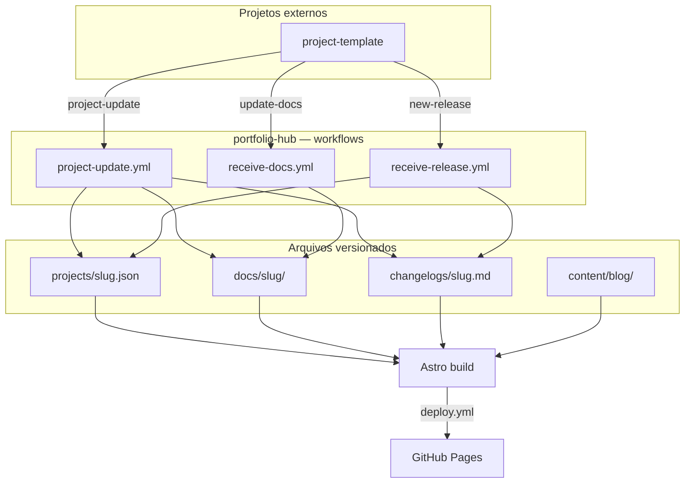
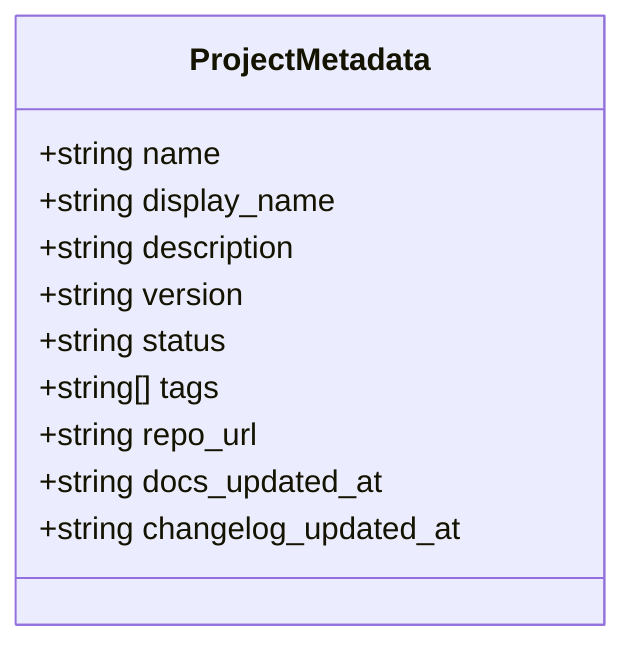
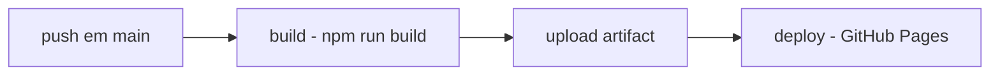
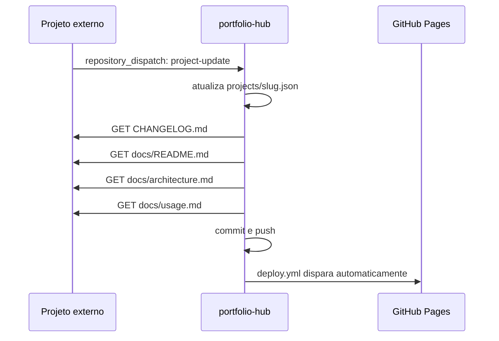
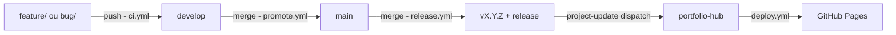
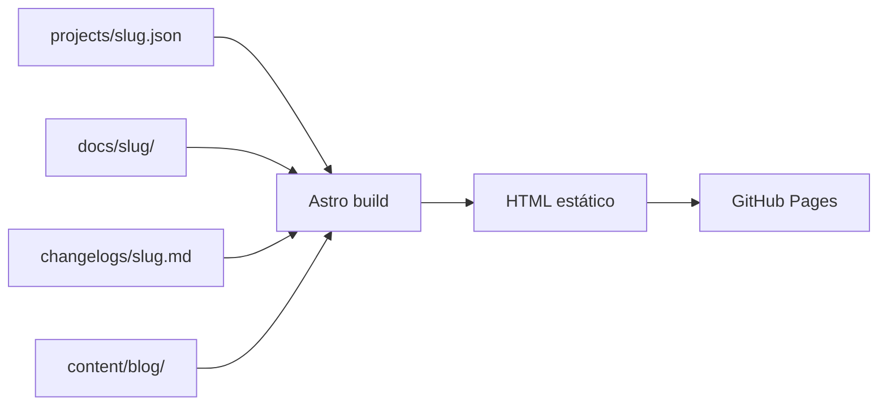

# Arquitetura

O `portfolio-hub` é um site estático que agrega metadados, documentação e changelogs de múltiplos projetos. Ele não executa os projetos, não tem backend em runtime e não depende de nenhuma API externa para montar o conteúdo principal — tudo parte de arquivos versionados no Git.

## Visão geral



## Camadas principais

### 1. Metadados dos projetos

Cada projeto possui um arquivo em `projects/<slug>.json` que define o que é exibido nos cards e na página do projeto.



Esse arquivo é criado automaticamente pelo workflow `project-update.yml` na primeira release de projetos integrados via `project-template`. Pode também ser criado manualmente para projetos que não usam automação.

### 2. Documentação por projeto

A pasta `docs/<slug>/` contém os arquivos Markdown técnicos do projeto. Cada arquivo pode definir:

- `title` via frontmatter — nome exibido na sidebar
- `icon` via frontmatter — ícone da aba
- diagramas Mermaid inline

Arquivos comuns: `README.md`, `architecture.md`, `usage.md`, `api.md`, `security.md`

### 3. Changelog por projeto

Cada projeto mantém um arquivo em `changelogs/<slug>.md`. Essa camada é separada da documentação intencionalmente:

- documentação explica **como** o projeto funciona
- changelog explica **o que mudou** entre versões

### 4. Blog

Posts em `content/blog/*.md` com frontmatter YAML. O nome do arquivo define a URL (`content/blog/meu-post.md` → `/blog/meu-post`).

### 5. Renderização

O Astro lê todos os arquivos no build e gera HTML estático. Não há fetch de dados em runtime.

| Página | Arquivo |
|---|---|
| Homepage com projetos e filtros | `src/pages/index.astro` |
| Página de projeto com docs e changelog | `src/pages/projects/[slug].astro` |
| Listagem do blog | `src/pages/blog/index.astro` |
| Post individual | `src/pages/blog/[slug].astro` |
| Navbar compartilhada | `src/components/Nav.astro` |
| Shell global e tokens CSS | `src/layouts/Layout.astro` |

## Workflows do hub

### deploy.yml

Dispara em todo push para `main` (inclusive via `workflow_dispatch`). Executa dois jobs em sequência: `build` (Astro) e `deploy` (GitHub Pages).



### changelog.yml

Dispara em push para `main`, ignorando mudanças em `CHANGELOG.md`, `docs/`, `content/` e `projects/`. Gera o `CHANGELOG.md` do próprio hub com conventional-changelog e commita com `[skip ci]`.

### project-update.yml

Dispara via `repository_dispatch: project-update`. Usado pelo `project-template` após cada release.

**O que faz:**
1. Cria ou atualiza `projects/<slug>.json` com versão, descrição, tags e repo_url
2. Preserva `status` existente (default `active` na criação)
3. Busca `CHANGELOG.md` do repositório → `changelogs/<slug>.md`
4. Busca `docs/README.md`, `docs/architecture.md`, `docs/usage.md` → `docs/<slug>/`
5. Commita e faz push com `PORTFOLIO_TOKEN` (dispara o deploy)



### receive-docs.yml

Dispara via `repository_dispatch: update-docs`. Para repositórios que atualizam documentação independentemente de releases.

**O que faz:**
1. Lista todos os arquivos em `docs/` no commit especificado
2. Baixa cada arquivo → `docs/<slug>/`
3. Atualiza `docs_updated_at` em `projects/<slug>.json`
4. Commita e faz push

**Payload esperado:**

```json
{
  "project": "nome-do-projeto",
  "repo_url": "https://github.com/org/repo",
  "commit_sha": "abc123def",
  "updated_at": "2026-04-21T10:00:00Z"
}
```

### receive-release.yml

Dispara via `repository_dispatch: new-release`. Para repositórios com processo de release próprio.

**O que faz:**
1. Atualiza `projects/<slug>.json` com nova versão, preservando `docs_updated_at` e `tags` existentes
2. Busca `CHANGELOG.md` do repositório (fallback: body da última release no GitHub)
3. Commita e faz push

**Payload esperado:**

```json
{
  "project": "nome-do-projeto",
  "display_name": "Nome Exibido",
  "version": "1.2.0",
  "description": "Descrição do projeto",
  "repo_url": "https://github.com/org/repo",
  "updated_at": "2026-04-21T10:00:00Z"
}
```

## Workflows do project-template

Projetos criados a partir do `project-template` têm três workflows próprios:



| Workflow | Gatilho | Função |
|---|---|---|
| `ci.yml` | push em `feature/**` ou `bug/**` | Abre PR automático para `develop` |
| `promote.yml` | push em `develop` | Abre PR automático para `main` |
| `release.yml` | push em `main` | Bump de versão, changelog, tag, release, notifica hub |

### release.yml — lógica de bump

| Commits contêm | Bump | Exemplo |
|---|---|---|
| `tipo!:` ou `BREAKING CHANGE` | major | `1.2.0 -> 2.0.0` |
| `feat:` | minor | `1.2.0 -> 1.3.0` |
| qualquer outro | patch | `1.2.0 -> 1.2.1` |

Mudanças apenas em `docs/` não disparam bump — o `release.yml` detecta isso e encerra sem criar tag.

## Fluxo de build



## Decisões arquiteturais

### O hub como agregador, não runtime

O `portfolio-hub` centraliza apresentação, documentação e changelog. Cada projeto pode usar qualquer stack ou estratégia de deploy — o hub não sabe nem precisa saber como o projeto roda.

### Separação entre docs e releases

Existem dois tipos de atualização com naturezas distintas:

| Tipo | Objetivo | Atualiza |
|---|---|---|
| `update-docs` | Conteúdo técnico evoluiu | `docs/<slug>/`, `docs_updated_at` |
| `new-release` | Nova versão publicada | `version`, `changelog`, `changelog_updated_at` |
| `project-update` | Tudo de uma vez (usado pelo template) | Todos os campos |

### Git como fonte de verdade

Toda atualização passa por um commit no repositório do hub. Isso garante:

- histórico auditável de todas as mudanças
- rollback trivial via `git revert`
- revisão em pull requests antes de ir ao ar
- nenhum estado externo para gerenciar

### PORTFOLIO_TOKEN como ponte entre repositórios

O token permite que projetos externos façam push de conteúdo para o hub. Armazenado como secret da organização MatheusAzevedoDev, é herdado por todos os repositórios sem configuração individual.

## Sistema visual

A interface foi construída para leitura técnica:

- tipografia: **Syne** (display/headings), **DM Sans** (corpo), **JetBrains Mono** (código)
- tokens CSS em custom properties (`--fg-1`, `--accent`, `--border`, etc.)
- navbar compartilhada via componente `Nav.astro`
- cards com filtros por tag e status na homepage
- sidebar de documentação gerada a partir dos arquivos em `docs/<slug>/`
- renderização de Markdown com suporte nativo a Mermaid
- âncoras automáticas em todos os headings para navegação por índice

## Escalabilidade

Adicionar um novo projeto ao hub requer apenas:

1. um JSON em `projects/`
2. uma pasta em `docs/`
3. um arquivo em `changelogs/`

O restante da renderização é reaproveitado automaticamente. O modelo funciona para qualquer número de projetos sem mudança de código.
