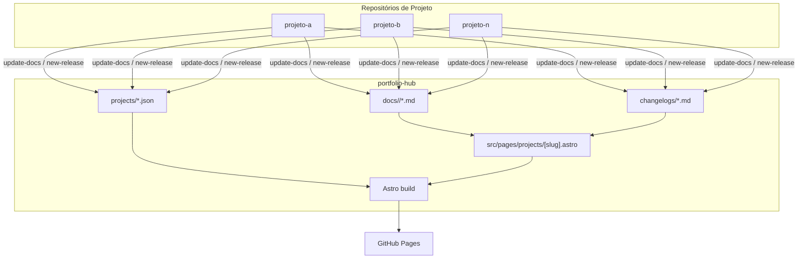
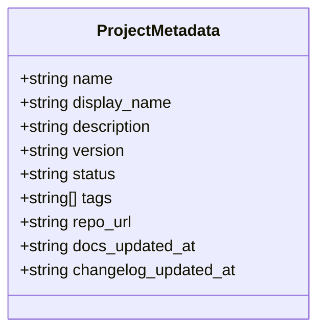
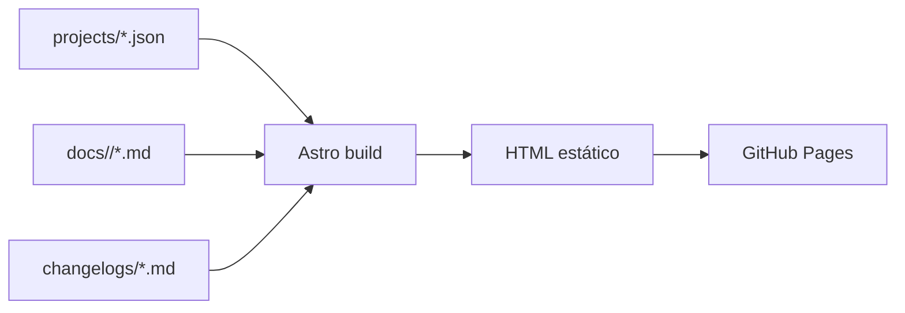
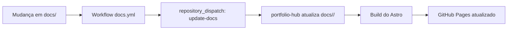
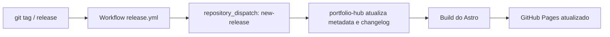
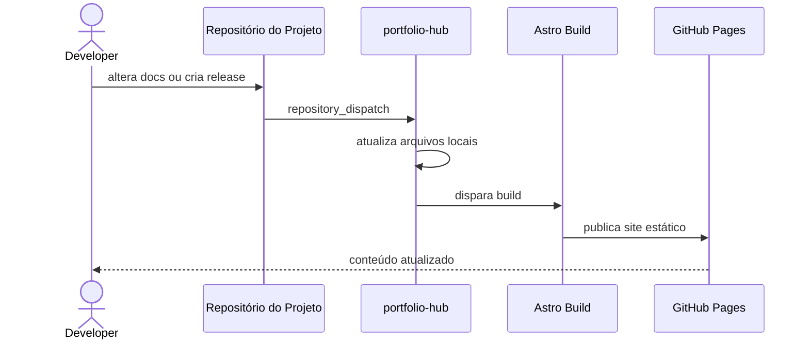

# Arquitetura

O `portfolio-hub` é um site estático que agrega metadados, documentação e changelogs de múltiplos projetos. A arquitetura foi pensada para manter o hub simples: ele não executa os projetos, não faz deploy da aplicação final e não depende de backend em tempo de execução para renderizar o conteúdo principal.

## Visão geral

O fluxo central é:

1. o hub lê arquivos locais versionados em Git;
2. o Astro gera páginas estáticas a partir desses arquivos;
3. o GitHub Pages publica o site final;
4. repositórios externos podem enviar eventos para atualizar docs e releases.



## Camadas principais

### 1. Metadados dos projetos

Cada projeto possui um arquivo em `projects/<slug>.json`.

Essa camada define:

- nome e slug do projeto;
- descrição curta;
- versão atual;
- status (`active`, `wip`, `archived`);
- tags;
- URL do repositório;
- timestamps de atualização.

Exemplo de responsabilidade dessa camada:



## 2. Documentação por projeto

A pasta `docs/<slug>/` contém o conteúdo técnico do projeto em Markdown.

Cada arquivo pode definir:

- `title` via frontmatter;
- `icon` via frontmatter;
- diagramas Mermaid;
- qualquer estrutura de documentação que faça sentido para o projeto.

Arquivos comuns:

- `README.md`
- `architecture.md`
- `usage.md`
- `api.md`
- `security.md`

## 3. Changelog por projeto

Cada projeto pode manter um arquivo em `changelogs/<slug>.md`.

Essa camada representa o histórico de mudanças do projeto e é separada da documentação para manter responsabilidades claras:

- documentação explica como o projeto funciona;
- changelog explica o que mudou entre versões.

## 4. Renderização do site

O Astro lê o conteúdo do sistema de arquivos no build e gera páginas estáticas.

As páginas principais são:

| Arquivo | Responsabilidade |
|---|---|
| `src/pages/index.astro` | homepage, filtros, listagem de projetos |
| `src/pages/projects/[slug].astro` | página do projeto, docs, tabs, changelog |
| `src/layouts/Layout.astro` | shell global, tokens visuais, fontes e scripts globais |

## Fluxo de build

O build do site é orientado por arquivos locais. Não existe necessidade de buscar dados de uma API em runtime para montar o conteúdo principal.



## Fluxo de atualização de documentação

Quando um projeto quer atualizar apenas a documentação, o fluxo ideal é isolado e não depende de uma release formal.



### Resultado esperado

Esse fluxo deve atualizar principalmente:

- `docs/<slug>/`
- `projects/<slug>.json` → `docs_updated_at`

## Fluxo de release

Quando um projeto publica uma nova versão, o hub recebe um evento separado.



### Resultado esperado

Esse fluxo deve atualizar principalmente:

- `projects/<slug>.json` → `version`
- `projects/<slug>.json` → `changelog_updated_at`
- `changelogs/<slug>.md`

## Sequência completa de uma atualização



## Decisões arquiteturais

### O hub é um agregador, não o runtime do projeto

O `portfolio-hub` existe para centralizar apresentação, documentação e changelog. Ele não substitui a infraestrutura real de cada projeto.

Isso permite que cada projeto use qualquer stack ou estratégia de deploy:

- GitHub Pages
- Vercel
- Netlify
- Docker
- VPS
- Kubernetes
- AWS
- qualquer outro ambiente

### Separação entre docs e releases

Existem dois tipos de atualização com naturezas diferentes:

| Tipo | Objetivo | Atualiza |
|---|---|---|
| `update-docs` | Atualizar conteúdo técnico | `docs/<slug>/`, `docs_updated_at` |
| `new-release` | Registrar uma nova versão | `version`, `changelog`, `changelog_updated_at` |

Essa separação evita misturar melhoria de documentação com release formal.

### Arquivos como fonte de verdade

A arquitetura usa Git como fonte de verdade. Isso simplifica:

- revisão em pull requests;
- versionamento do conteúdo;
- auditoria de mudanças;
- rollback;
- histórico técnico do portfolio.

## Sidebar de documentação

A sidebar da página de projeto é gerada a partir dos arquivos existentes em `docs/<slug>/`.

Cada item pode ser definido por:

- nome do arquivo;
- `title` no frontmatter;
- `icon` no frontmatter;
- ordem por prefixo numérico ou convenção de nomes.

Exemplo de documentos:

```text
docs/meu-projeto/
├── README.md
├── architecture.md
├── usage.md
├── api.md
└── monitoring.md
```

## Sistema visual e navegação

A interface atual foi construída com foco em leitura técnica:

- homepage com cards e filtros;
- página de projeto com header fixo, sidebar e pills;
- tipografia com `Syne`, `DM Sans` e `JetBrains Mono`;
- tokens visuais definidos em CSS custom properties;
- renderização de Markdown com suporte a Mermaid;
- ícones de documentação configuráveis por frontmatter.

## Escalabilidade do modelo

Essa arquitetura funciona bem porque adicionar um novo projeto exige apenas:

1. um JSON em `projects/`;
2. uma pasta em `docs/`;
3. um changelog em `changelogs/`.

O restante da renderização é reaproveitado automaticamente pelo Astro.

## Resumo

Em termos práticos, a arquitetura do `portfolio-hub` se apoia em quatro princípios:

1. **conteúdo em arquivos versionados**;
2. **build estático com Astro**;
3. **publicação simples via GitHub Pages**;
4. **integração opcional por workflows entre repositórios**.

Esse modelo mantém o portfolio previsível, fácil de evoluir e independente da stack interna de cada projeto.
