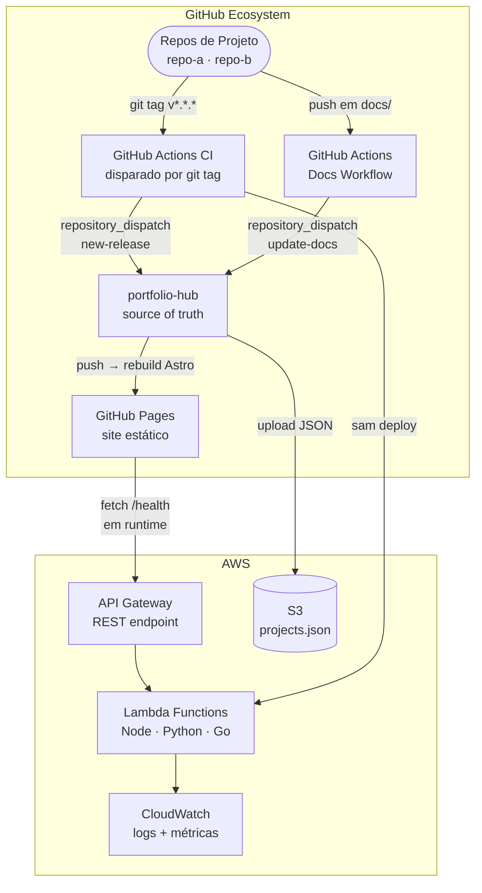
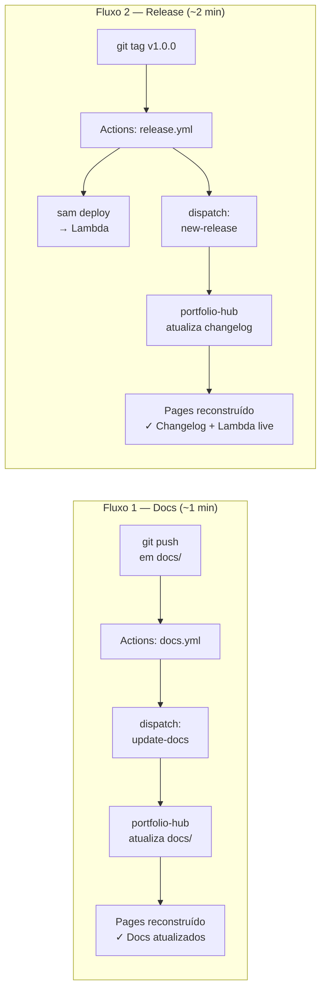
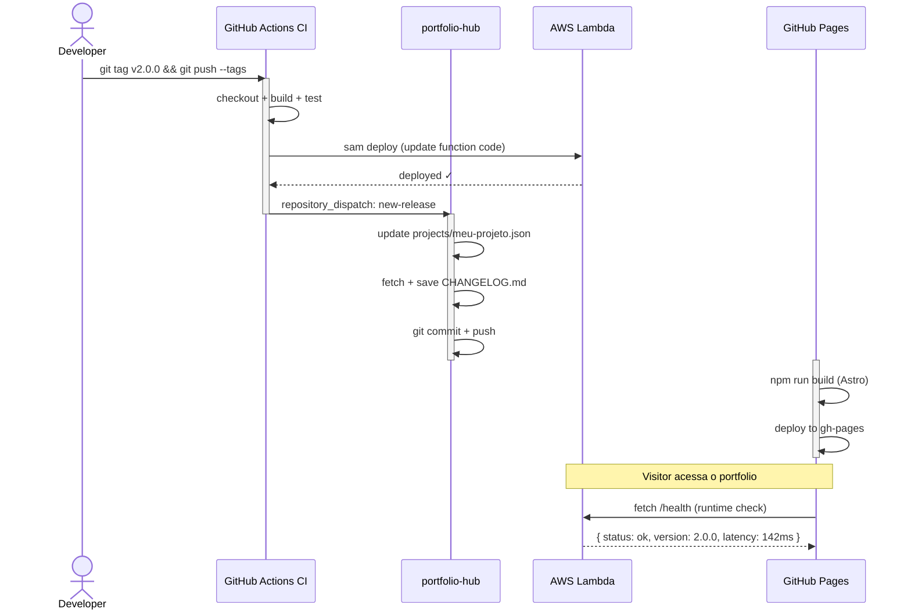

# Arquitetura

## Visão Geral do Sistema

## Dois Fluxos Independentes

O coração do design é a separação entre **documentação** (iterativa) e **changelog** (marco formal):

## Fluxo Completo de uma Release

## Componentes Detalhados

### GitHub Ecosystem

| Componente | Função |
|---|---|
| `repo-projeto-*` | Código-fonte com workflows `docs.yml` e `release.yml` |
| `portfolio-hub` | Repositório central: agrega JSONs, docs e changelogs |
| GitHub Actions CI | Disparado por tag: build, test, empacota e deploya Lambda |
| GitHub Actions Deploy | Disparado por push no hub: reconstrói Astro e publica no Pages |
| GitHub Pages | Serve o portfolio estático com HTTPS |

### AWS

| Serviço | Função |
|---|---|
| **API Gateway** | Endpoint REST público por projeto |
| **Lambda** | Executa o código — cobra apenas por invocação |
| **S3** | Armazena `projects.json` consolidado |
| **CloudWatch** | Logs, métricas e alertas das Lambdas |
| **IAM + OIDC** | Autenticação sem chaves estáticas |

## Decisões de Design (ADRs)

### ADR-001: GitHub Pages em vez de S3 Static Hosting

**Decisão:** GitHub Pages para hosting.

**Motivo:** Zero custo, HTTPS automático, integração nativa com Actions. S3 + CloudFront adicionaria R$ 10–30/mês sem benefício real.

### ADR-002: Lambda em vez de ECS Fargate

**Decisão:** Lambda functions.

**Motivo:** Portfolio tem tráfego intermitente (zero na maioria do tempo). Fargate cobra por hora mesmo sem tráfego. Lambda: free tier de 1 milhão de invocações/mês.

**Trade-off:** Cold start de 200–800ms. Aceitável para demonstrações.

### ADR-005: OIDC em vez de chaves estáticas na AWS

**Decisão:** OpenID Connect para autenticação do GitHub Actions.

**Motivo:** Chaves estáticas podem vazar em logs ou forks. OIDC usa tokens temporários por execução.

### ADR-006: Dois fluxos independentes

**Decisão:** Eventos `update-docs` e `new-release` separados.

**Motivo:** Documentação e releases têm cadências completamente diferentes. Misturar os dois force-acoplaria a qualidade da documentação ao ritmo de releases.
