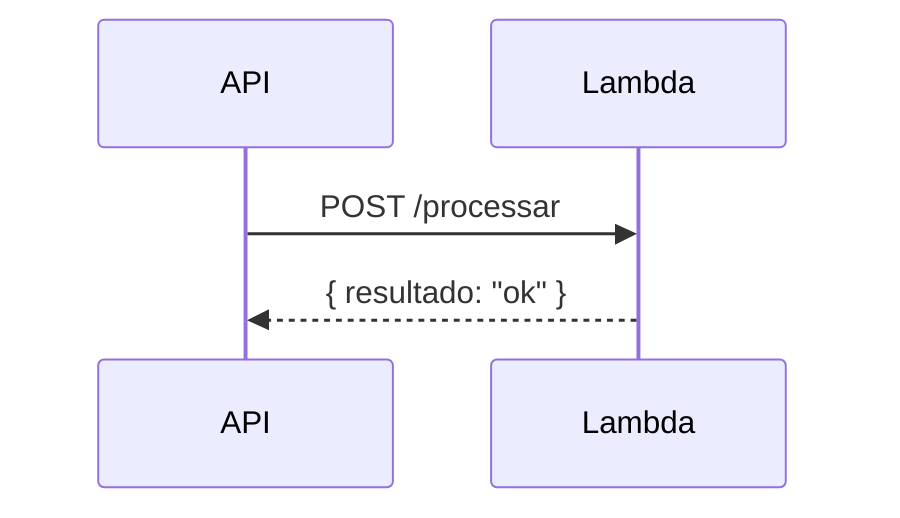

# Como Usar

## Pré-requisitos

- Conta GitHub com repositório `portfolio-hub` configurado para GitHub Pages
- Conta AWS com permissões para Lambda, API Gateway, CloudFormation, S3
- AWS CLI e SAM CLI instalados localmente

```bash
# Instalar dependências (macOS)
brew install awscli aws-sam-cli

# Configurar credenciais AWS
aws configure
```

## Configuração Inicial

### 1. Fork / clone do portfolio-hub

```bash
git clone https://github.com/seu-usuario/portfolio-hub
cd portfolio-hub

# Atualizar configurações
# - src/config.ts  → seu usuário GitHub
# - astro.config.mjs → site URL e base path
npm install
```

### 2. Habilitar GitHub Pages

No repositório `portfolio-hub`:

1. **Settings** → **Pages**
2. Source: **GitHub Actions**
3. O workflow `deploy.yml` vai publicar automaticamente a cada push na branch `main`

### 3. Criar IAM Role para OIDC

```bash
# Criar OIDC provider (uma vez por conta AWS)
aws iam create-open-id-connect-provider \
  --url https://token.actions.githubusercontent.com \
  --client-id-list sts.amazonaws.com \
  --thumbprint-list 6938fd4d98bab03faadb97b34396831e3780aea1

# Criar a role com a policy do arquivo iam-policy.json
aws iam create-role \
  --role-name GitHubActionsPortfolioRole \
  --assume-role-policy-document file://iam-trust-policy.json

aws iam put-role-policy \
  --role-name GitHubActionsPortfolioRole \
  --policy-name PortfolioDeploy \
  --policy-document file://iam-policy.json
```

### 4. Configurar GitHub Secrets

Em cada repositório de projeto, adicione:

| Secret | Valor |
|---|---|
| `PORTFOLIO_TOKEN` | PAT com escopo `repo` no portfolio-hub |
| `AWS_ACCOUNT_ID` | ID numérico da sua conta AWS (12 dígitos) |

## Adicionando um Novo Projeto

### Passo 1 — Criar o JSON de metadados

```bash
# portfolio-hub/projects/meu-novo-projeto.json
{
  "name": "meu-novo-projeto",
  "display_name": "Meu Novo Projeto",
  "description": "O que esse projeto faz em uma frase.",
  "version": "0.1.0",
  "runtime": "python3.12",
  "tags": ["api", "python"],
  "api_endpoint": "",
  "repo_url": "https://github.com/seu-usuario/meu-novo-projeto",
  "region": "sa-east-1",
  "docs_updated_at": "",
  "changelog_updated_at": ""
}
```

Commit e push: o portfolio já vai exibir o projeto na homepage.

### Passo 2 — Adicionar documentação

No repositório do projeto, crie a pasta `docs/`:

```
meu-novo-projeto/
└── docs/
    ├── README.md        ← visão geral obrigatória
    ├── architecture.md  ← adicione diagramas Mermaid aqui
    └── usage.md         ← exemplos de request/response
```

Qualquer push alterando `docs/` dispara o fluxo de documentação.

### Passo 3 — Adicionar workflows ao projeto

Copie os workflows da pasta `.github/workflows/` deste repositório de exemplo para o seu projeto:
- `docs.yml` — dispara ao alterar `docs/`
- `release.yml` — dispara ao criar um `git tag`

### Passo 4 — Primeira release

```bash
# No repositório do projeto
git tag v0.1.0
git push --tags
```

O workflow de release vai:
1. Buildar e testar o projeto
2. Deployar a Lambda na AWS
3. Notificar o portfolio-hub com a versão e endpoint

## Diagramas com Mermaid

A documentação suporta **diagramas Mermaid** nativamente. Use blocos de código com linguagem `mermaid`:

~~~markdown

~~~

Tipos suportados: `flowchart`, `sequenceDiagram`, `classDiagram`, `erDiagram`, `gantt`, `pie`, `gitGraph`.

## Verificando o Deploy

Após um `git tag`, você pode monitorar:

```bash
# Status do stack CloudFormation
aws cloudformation describe-stacks \
  --stack-name portfolio-prod-meu-projeto \
  --query "Stacks[0].StackStatus"

# Invocar a Lambda diretamente
aws lambda invoke \
  --function-name portfolio-prod-meu-projeto \
  --payload '{"path":"/health","httpMethod":"GET"}' \
  response.json && cat response.json

# Ver logs no CloudWatch
aws logs tail /aws/lambda/portfolio-prod-meu-projeto --follow
```
