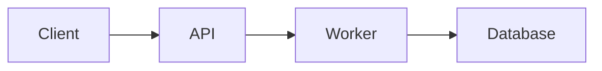

# Como Usar

Guia operacional do `portfolio-hub`: como adicionar projetos, organizar documentação, integrar repositórios externos e manter o site coerente.

## Instalação local

```bash
npm install
npm run dev     # http://localhost:4321
npm run build   # build de produção
npm run preview # preview do build
```

## Formas de uso

### 1. Gestão manual

Você edita diretamente os arquivos no repositório do hub:

- `projects/<slug>.json`
- `docs/<slug>/*.md`
- `changelogs/<slug>.md`

Adequado para manutenção pontual ou projetos sem automação.

### 2. Gestão automatizada via project-template

Cada projeto vive em seu próprio repositório e envia atualizações ao hub via `repository_dispatch`. O hub recebe, atualiza os arquivos e dispara um novo deploy.

Esse modelo é o mais indicado quando cada projeto tem ciclo de vida próprio.

---

## Criando um projeto no hub

### Estrutura mínima

```text
projects/meu-projeto.json
docs/meu-projeto/
    └── README.md
changelogs/meu-projeto.md
```

### Arquivo de metadados

Crie `projects/meu-projeto.json`:

```json
{
  "name": "meu-projeto",
  "display_name": "Meu Projeto",
  "description": "Descrição curta e objetiva do projeto.",
  "version": "1.0.0",
  "status": "active",
  "tags": ["go", "api", "docker"],
  "repo_url": "https://github.com/MatheusAzevedoDev/meu-projeto",
  "docs_updated_at": "2026-04-21T00:00:00Z",
  "changelog_updated_at": "2026-04-21T00:00:00Z"
}
```

### Campos esperados

| Campo | Obrigatório | Descrição |
|---|---|---|
| `name` | Sim | Slug — deve bater com a pasta de docs e o arquivo de changelog |
| `display_name` | Sim | Nome exibido no card e na página |
| `description` | Sim | Resumo curto do projeto |
| `version` | Sim | Versão exibida na interface |
| `status` | Sim | Estado atual do projeto |
| `tags` | Sim | Lista de tags para filtros e contexto |
| `repo_url` | Sim | URL do repositório principal |
| `docs_updated_at` | Recomendado | Timestamp ISO da última atualização de docs |
| `changelog_updated_at` | Recomendado | Timestamp ISO da última atualização de changelog |

### Valores de `status`

| Valor | Uso |
|---|---|
| `active` | Projeto pronto, mantido ou em destaque |
| `wip` | Projeto em construção |
| `archived` | Encerrado ou mantido só como referência |

---

## Organizando a documentação

### Arquivos recomendados

```text
docs/meu-projeto/
├── README.md          # visão geral e quickstart
├── architecture.md    # fluxos, diagramas, decisões
├── usage.md           # setup, comandos, integração
├── api.md             # endpoints ou referência técnica
└── security.md        # permissões, autenticação
```

Outros documentos comuns: `deploy.md`, `monitoring.md`, `links.md`

### Ordem na sidebar

**Por prefixo numérico** (controle total):

```text
docs/meu-projeto/
├── 01-readme.md
├── 02-architecture.md
├── 03-usage.md
└── 04-api.md
```

**Por nomes convencionais** (mais simples):

Sem prefixo numérico, nomes como `README`, `architecture`, `usage` e `api` formam uma navegação previsível.

Use prefixo quando a ordem for crítica; use nomes convencionais quando quiser simplicidade.

### Frontmatter por documento

Cada documento pode definir título e ícone:

```md
---
title: Arquitetura
icon: layers
---

# Arquitetura
```

### Ícones disponíveis

| Ícone | Uso sugerido |
|---|---|
| `home` | README / visão geral |
| `layers` | architecture |
| `terminal` | usage / operação |
| `zap` ou `code` | api |
| `shield` | security |
| `package` | deploy |
| `chart` | monitoring |
| `clock` ou `changelog` | changelog |
| `link` | links externos |
| `database` | banco de dados |
| `settings` | configuração |

Se `icon` não for definido, o sistema infere pelo nome do arquivo.

### Exemplo completo de `README.md`

```md
---
title: Visão Geral
icon: home
---

# Meu Projeto

Resumo do projeto, objetivo, stack e contexto.

## Quickstart

```bash
go build ./...
./bin/meu-projeto
```
```

### Exemplo completo de `architecture.md`

~~~md
---
title: Arquitetura
icon: layers
---

# Arquitetura



## Decisões

| Decisão | Motivo |
|---|---|
| PostgreSQL | ACID necessário para consistência |
| gRPC interno | Latência baixa entre serviços |
~~~

---

## Changelog por projeto

Cada projeto deve ter `changelogs/<slug>.md`. Formato inspirado em **Keep a Changelog**:

```md
# Changelog

## [1.2.0] - 2026-04-21

### Added
- Suporte a múltiplos ambientes via variáveis de ambiente

### Changed
- Timeout de conexão reduzido de 30s para 10s

### Fixed
- Panic em request concorrente no pool de conexões

## [1.1.0] - 2026-03-15

### Added
- Endpoint de healthcheck em /health
```

### Categorias úteis

`Added` · `Changed` · `Fixed` · `Removed` · `Deprecated` · `Security`

Projetos usando o `project-template` têm o changelog gerado automaticamente a partir dos Conventional Commits.

---

## Integração com repositórios externos

Três eventos `repository_dispatch` são suportados pelo hub:

### `project-update` — tudo em um (recomendado)

Usado pelo `project-template`. Atualiza metadados, docs e changelog em uma única chamada.

```yaml
- name: Notificar portfolio-hub
  env:
    PORTFOLIO_TOKEN: ${{ secrets.PORTFOLIO_TOKEN }}
  run: |
    curl -s -X POST \
      -H "Authorization: token $PORTFOLIO_TOKEN" \
      -H "Accept: application/vnd.github.v3+json" \
      "https://api.github.com/repos/MatheusAzevedoDev/portfolio-hub/dispatches" \
      -d '{
        "event_type": "project-update",
        "client_payload": {
          "project": "meu-projeto",
          "display_name": "Meu Projeto",
          "version": "1.2.0",
          "description": "Descrição do projeto",
          "tags": ["go", "api"],
          "repo": "MatheusAzevedoDev/meu-projeto"
        }
      }'
```

### `update-docs` — somente documentação

Para repositórios que atualizam docs com frequência, independentemente de releases.

```yaml
name: docs

on:
  push:
    paths: ["docs/**"]
    branches: [main]

jobs:
  notify:
    runs-on: ubuntu-latest
    steps:
      - uses: actions/checkout@v4
      - name: Dispatch update-docs
        run: |
          SHA=$(git rev-parse HEAD)
          NOW=$(date -u +"%Y-%m-%dT%H:%M:%SZ")
          curl -s -X POST \
            -H "Authorization: token ${{ secrets.PORTFOLIO_TOKEN }}" \
            -H "Accept: application/vnd.github.v3+json" \
            "https://api.github.com/repos/MatheusAzevedoDev/portfolio-hub/dispatches" \
            -d "{
              \"event_type\": \"update-docs\",
              \"client_payload\": {
                \"project\": \"meu-projeto\",
                \"repo_url\": \"https://github.com/MatheusAzevedoDev/meu-projeto\",
                \"commit_sha\": \"$SHA\",
                \"updated_at\": \"$NOW\"
              }
            }"
```

O hub busca todos os arquivos de `docs/` no commit especificado e atualiza `docs/meu-projeto/`.

### `new-release` — somente release

Para repositórios com processo de release próprio que não usam o `project-template`.

```yaml
name: release

on:
  push:
    tags: ["v*"]

jobs:
  notify:
    runs-on: ubuntu-latest
    steps:
      - name: Dispatch new-release
        run: |
          NOW=$(date -u +"%Y-%m-%dT%H:%M:%SZ")
          curl -s -X POST \
            -H "Authorization: token ${{ secrets.PORTFOLIO_TOKEN }}" \
            -H "Accept: application/vnd.github.v3+json" \
            "https://api.github.com/repos/MatheusAzevedoDev/portfolio-hub/dispatches" \
            -d "{
              \"event_type\": \"new-release\",
              \"client_payload\": {
                \"project\": \"meu-projeto\",
                \"display_name\": \"Meu Projeto\",
                \"version\": \"${GITHUB_REF_NAME#v}\",
                \"description\": \"Descrição do projeto\",
                \"repo_url\": \"https://github.com/MatheusAzevedoDev/meu-projeto\",
                \"updated_at\": \"$NOW\"
              }
            }"
```

O hub busca o `CHANGELOG.md` do repositório (fallback: body da última release no GitHub) e atualiza `changelogs/meu-projeto.md`.

---

## Token para integração

| Secret | Descrição |
|---|---|
| `PORTFOLIO_TOKEN` | PAT com acesso de escrita ao repositório `portfolio-hub` |

O token está configurado como secret da organização **MatheusAzevedoDev** e é herdado automaticamente por todos os repositórios da org. Para repositórios externos à organização, adicione o secret manualmente em **Settings → Secrets and variables → Actions**.

Boas práticas:
- armazene apenas em GitHub Secrets, nunca em código
- rotacione periodicamente
- use o menor escopo necessário

---

## Convenções de tags

As tags em `projects/<slug>.json` comunicam o tipo e contexto do projeto:

- **stack:** `astro`, `react`, `node`, `python`, `go`, `typescript`
- **domínio:** `api`, `frontend`, `infra`, `automation`, `cli`, `library`
- **capacidades:** `github-actions`, `docker`, `postgres`, `gitops`, `observability`

Prefira tags curtas, evite duplicidade semântica e mantenha consistência entre projetos.

---

## Checklist para um novo projeto

```text
[ ] Repo criado a partir do project-template (ou manualmente)
[ ] npm install rodado (ativa Husky automaticamente)
[ ] PORTFOLIO_TOKEN verificado (herdado da org ou configurado manualmente)
[ ] projects/<slug>.json criado no hub (ou aguardar criação automática)
[ ] docs/<slug>/README.md preenchido com visão geral
[ ] docs/<slug>/architecture.md preenchido com decisões de design
[ ] changelogs/<slug>.md criado (ou aguardar geração automática)
[ ] Frontmatter com title e icon definido nos documentos
[ ] Status e tags revisados
[ ] Primeiro commit em feature/ mergeado até main
[ ] Verificar que hub recebeu o project-update e fez deploy
```
