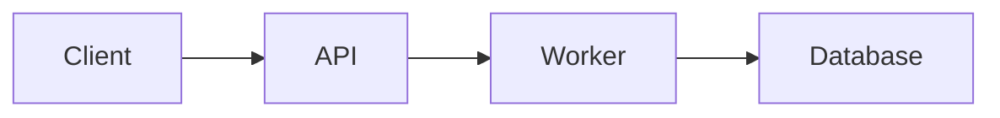
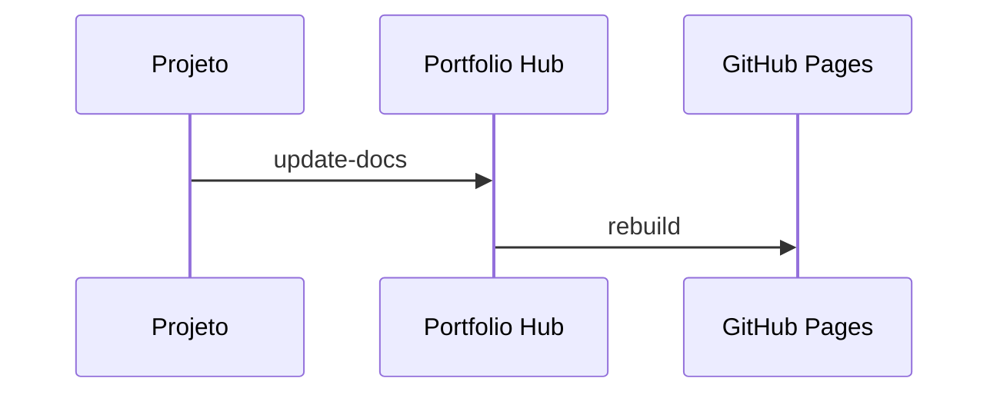

# Como Usar

Este guia mostra como operar o `portfolio-hub` no dia a dia: adicionar projetos, organizar documentação, integrar repositórios externos, publicar changelogs e manter o site coerente.

## Formas de uso

O hub pode ser usado de duas maneiras:

### 1. Gestão manual no próprio repositório

Você atualiza diretamente:

- `projects/<slug>.json`
- `docs/<slug>/*.md`
- `changelogs/<slug>.md`

Esse é o caminho mais simples para começar.

### 2. Gestão distribuída com automação

Cada projeto vive em seu próprio repositório e envia atualizações para o hub por workflow.

Esse modelo é o mais indicado quando:

- cada projeto tem ciclo de vida próprio;
- você quer versionar docs junto do projeto original;
- o hub deve apenas agregar e publicar conteúdo.

## Instalação local

Para rodar o hub localmente:

```bash
npm install
npm run dev
```

Para gerar o build de produção:

```bash
npm run build
```

## Estrutura mínima de um projeto

Para um projeto aparecer bem no hub, mantenha estes três elementos:

```text
projects/meu-projeto.json
docs/meu-projeto/
changelogs/meu-projeto.md
```

### Exemplo de estrutura

```text
portfolio-hub/
├── projects/
│   └── meu-projeto.json
├── docs/
│   └── meu-projeto/
│       ├── README.md
│       ├── architecture.md
│       ├── usage.md
│       └── api.md
└── changelogs/
    └── meu-projeto.md
```

## Criando um projeto novo

### Passo 1 — criar o arquivo em `projects/`

Crie `projects/meu-projeto.json`:

```json
{
  "name": "meu-projeto",
  "display_name": "Meu Projeto",
  "description": "Descrição curta e objetiva do projeto.",
  "version": "0.1.0",
  "status": "active",
  "tags": ["astro", "typescript", "docs"],
  "repo_url": "https://github.com/seu-usuario/meu-projeto",
  "docs_updated_at": "2026-04-21T00:00:00Z",
  "changelog_updated_at": "2026-04-21T00:00:00Z"
}
```

### Campos esperados

| Campo | Obrigatório | Descrição |
|---|---|---|
| `name` | Sim | Slug do projeto. Deve bater com pasta de docs e arquivo de changelog |
| `display_name` | Sim | Nome exibido no card e na página |
| `description` | Sim | Resumo curto do projeto |
| `version` | Sim | Versão exibida na interface |
| `status` | Recomendado | Estado atual do projeto |
| `tags` | Sim | Lista de tags para filtros e contexto |
| `repo_url` | Sim | URL do repositório principal |
| `docs_updated_at` | Recomendado | Timestamp ISO da última atualização de docs |
| `changelog_updated_at` | Recomendado | Timestamp ISO da última atualização de changelog |

### Valores de `status`

| Valor | Uso recomendado |
|---|---|
| `active` | Projeto está pronto, mantido ou em destaque |
| `wip` | Projeto ainda está sendo construído |
| `archived` | Projeto legado, encerrado ou só para referência |

## Adicionando documentação

Crie a pasta `docs/meu-projeto/` e adicione arquivos Markdown.

Exemplo:

```text
docs/meu-projeto/
├── README.md
├── architecture.md
├── usage.md
├── api.md
└── security.md
```

### Documentos mais comuns

| Arquivo | Objetivo |
|---|---|
| `README.md` | Visão geral do projeto |
| `architecture.md` | Estrutura, fluxos, decisões técnicas |
| `usage.md` | Setup, comandos, integração, operação |
| `api.md` | Endpoints, contratos ou referência |
| `security.md` | Permissões, autenticação, políticas |
| `deploy.md` | Estratégia de deploy |
| `monitoring.md` | Logs, métricas, observabilidade |

## Ordem da documentação na sidebar

A sidebar é montada a partir dos arquivos da pasta do projeto.

### Estratégia 1 — ordem por prefixo

Se você quiser controle total, use prefixos numéricos:

```text
docs/meu-projeto/
├── 01-readme.md
├── 02-architecture.md
├── 03-usage.md
└── 04-api.md
```

### Estratégia 2 — nomes convencionais

Se preferir algo mais simples, use nomes previsíveis:

- `README.md`
- `architecture.md`
- `usage.md`
- `api.md`

### Recomendação

- use prefixo quando a ordem importar muito;
- use nomes convencionais quando quiser simplicidade;
- evite misturar muitos padrões no mesmo projeto.

## Títulos e ícones por frontmatter

Cada documento pode definir metadados próprios no topo do arquivo.

Exemplo:

```md
---
title: Arquitetura
icon: layers
---

# Arquitetura
```

### Campos suportados

| Campo | Descrição |
|---|---|
| `title` | Nome exibido na navegação |
| `icon` | Ícone da sidebar e das abas do documento |

### Ícones disponíveis

O sistema já suporta estes nomes:

- `home`
- `layers`
- `terminal`
- `code`
- `zap`
- `file`
- `book`
- `changelog`
- `clock`
- `shield`
- `database`
- `settings`
- `list`
- `star`
- `link`
- `chart`
- `package`
- `github`

### Exemplo por tipo de documento

| Documento | Ícone sugerido |
|---|---|
| `README.md` | `home` |
| `architecture.md` | `layers` |
| `usage.md` | `terminal` |
| `api.md` | `zap` ou `code` |
| `security.md` | `shield` |
| `deploy.md` | `package` |
| `monitoring.md` | `chart` |
| `links.md` | `link` |
| `changelog.md` | `clock` ou `changelog` |

Se você não definir `icon`, o sistema tenta inferir automaticamente a partir do nome do arquivo.

## Exemplo completo de documentação

### `README.md`

```md
---
title: Visão Geral
icon: home
---

# Meu Projeto

Resumo do projeto, objetivo, stack e contexto.
```

### `architecture.md`

~~~md
---
title: Arquitetura
icon: layers
---

# Arquitetura


~~~

### `usage.md`

~~~md
---
title: Como Usar
icon: terminal
---

# Como Usar

## Instalação

```bash
npm install
npm run dev
```
~~~

## Suporte a Mermaid

Os documentos aceitam diagramas Mermaid.

Exemplo:



Isso é útil para documentar:

- fluxos de deploy;
- arquitetura de serviços;
- pipelines CI/CD;
- integrações entre sistemas;
- sequências operacionais.

## Changelog por projeto

Cada projeto deve ter seu próprio arquivo em `changelogs/<slug>.md`.

### Formato recomendado

Use um padrão inspirado em **Keep a Changelog**.

Exemplo:

```md
# Changelog

## [1.1.0] - 2026-04-21

### Added
- Suporte a ícones por frontmatter
- Filtro por status na homepage

### Changed
- Reorganização da documentação do projeto

### Fixed
- Correção da largura excessiva na landing page
```

### Convenções recomendadas

- uma entrada por release;
- usar cabeçalho com versão e data;
- separar mudanças em categorias;
- evitar listar cada commit literalmente;
- priorizar informação útil para quem lê o projeto.

### Categorias úteis

- `Added`
- `Changed`
- `Fixed`
- `Removed`
- `Deprecated`
- `Security`

## Integração com repositórios externos

Quando cada projeto vive no seu próprio repositório, você pode usar workflows para enviar atualizações ao hub.

Os dois eventos principais são:

- `update-docs`
- `new-release`

## Fluxo `update-docs`

Esse fluxo é usado quando a documentação do projeto muda.

### O que ele deve fazer

1. detectar mudanças em `docs/`;
2. autenticar com GitHub;
3. disparar um `repository_dispatch` para o `portfolio-hub`;
4. enviar metadados suficientes para o hub localizar o projeto;
5. permitir que o hub atualize `docs/<slug>/` e `docs_updated_at`.

### Exemplo conceitual

```yaml
name: docs

on:
  push:
    paths:
      - "docs/**"
    branches:
      - main

jobs:
  notify-portfolio:
    runs-on: ubuntu-latest
    steps:
      - name: Dispatch update-docs
        run: |
          curl -X POST \
            -H "Accept: application/vnd.github+json" \
            -H "Authorization: Bearer ${{ secrets.PORTFOLIO_TOKEN }}" \
            https://api.github.com/repos/uMatheusx/portfolio-hub/dispatches \
            -d "{\"event_type\":\"update-docs\",\"client_payload\":{\"project\":\"meu-projeto\",\"repo\":\"seu-usuario/meu-projeto\"}}"
```

## Fluxo `new-release`

Esse fluxo é usado quando uma release formal acontece.

### O que ele deve fazer

1. disparar em `git tag`;
2. gerar ou consolidar informações da release;
3. notificar o hub com versão, slug e dados relevantes;
4. permitir que o hub atualize `projects/<slug>.json`;
5. permitir que o hub atualize `changelogs/<slug>.md`.

### Exemplo conceitual

```yaml
name: release

on:
  push:
    tags:
      - "v*"

jobs:
  notify-portfolio:
    runs-on: ubuntu-latest
    steps:
      - name: Dispatch new-release
        run: |
          curl -X POST \
            -H "Accept: application/vnd.github+json" \
            -H "Authorization: Bearer ${{ secrets.PORTFOLIO_TOKEN }}" \
            https://api.github.com/repos/uMatheusx/portfolio-hub/dispatches \
            -d "{\"event_type\":\"new-release\",\"client_payload\":{\"project\":\"meu-projeto\",\"version\":\"${GITHUB_REF_NAME}\"}}"
```

## Token para integração

Para um repositório externo atualizar o hub, você normalmente precisa de um token com permissão para disparar eventos no repositório do portfolio.

### Opção prática

Usar um **Personal Access Token** armazenado como secret no repositório do projeto.

Exemplo de secret:

| Secret | Descrição |
|---|---|
| `PORTFOLIO_TOKEN` | Token com permissão para interagir com o repositório `portfolio-hub` |

### Cuidados

- use o menor escopo necessário;
- armazene apenas em GitHub Secrets;
- nunca commite o token;
- rotacione o token periodicamente;
- centralize a responsabilidade do token em uma conta controlada.

## Como manter o hub atualizado

### Atualização manual

Quando você editar diretamente o hub:

1. ajuste `projects/<slug>.json`;
2. adicione ou revise `docs/<slug>/`;
3. atualize `changelogs/<slug>.md`;
4. faça commit e push.

### Atualização automática

Quando usar repositórios externos:

1. mantenha docs e changelog no projeto original;
2. dispare workflows em mudanças de docs e releases;
3. deixe o hub receber, consolidar e publicar.

## Convenções recomendadas de tags

As tags em `projects/<slug>.json` ajudam a comunicar rapidamente o tipo do projeto.

Exemplos de tags úteis:

- stack: `astro`, `react`, `node`, `python`, `go`
- domínio: `api`, `frontend`, `infra`, `automation`, `cli`
- capacidades: `github-actions`, `docker`, `postgres`, `aws`, `observability`

Boas práticas:

- prefira tags curtas;
- evite duplicidade semântica;
- use termos consistentes entre projetos;
- pense nas tags como filtro visual e não como texto longo.

## Checklist para cadastrar um projeto novo

```text
[ ] Criar projects/<slug>.json
[ ] Definir name, display_name, description, version, status, tags e repo_url
[ ] Criar docs/<slug>/README.md
[ ] Criar docs/<slug>/architecture.md
[ ] Criar docs/<slug>/usage.md
[ ] Criar changelogs/<slug>.md
[ ] Definir frontmatter com title e icon
[ ] Validar a ordem dos documentos
[ ] Revisar tags e status
[ ] Fazer build local
```

## Resumo

O ciclo mais saudável para manter o `portfolio-hub` é:

1. tratar `projects/*.json` como fonte de metadados;
2. tratar `docs/<slug>/` como fonte da navegação técnica;
3. tratar `changelogs/<slug>.md` como histórico de releases;
4. usar `status`, `tags`, `title` e `icon` de forma consistente;
5. automatizar `update-docs` e `new-release` quando o projeto estiver em repositório separado.
